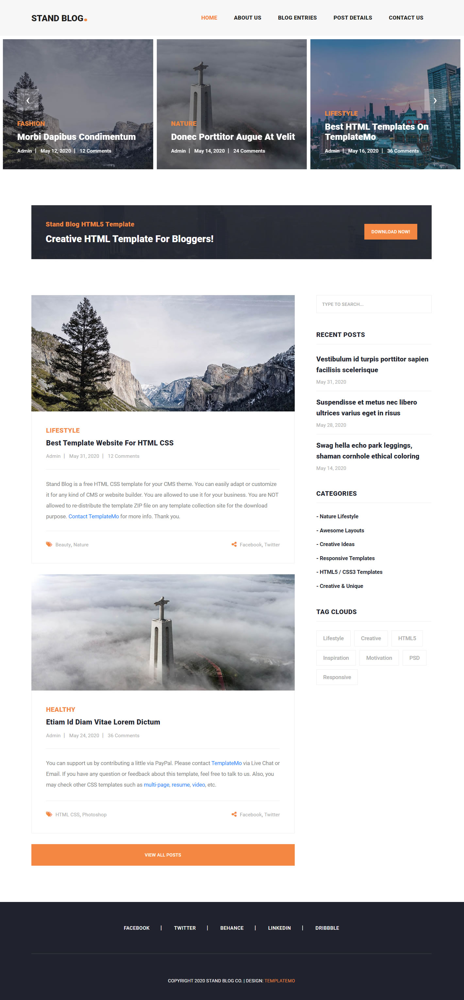

# PR2-Min-width-Stand-Blog

# Stand Blog

A responsive HTML5 blog template designed for personal or professional blogging. Built with **Bootstrap 5**, **SwiperJS**, and modern CSS techniques including **Flexbox**, **Grid**, and mobile-first responsive design.

## 🌐 Live Preview

## 📂 Project Structure

stand-blog/
├── css/
│ ├── all.min.css
│ ├── media.css
│ └── style.css
├── Font/
│ └── Roboto/
│ └── stylesheet.css
├── image/
│ ├── banner-item-01.jpg
│ ├── blog-post-01.jpg
│ └── ...
├── index.html
└── README.md

---

## 🚀 Features

- ✅ Fully Responsive Layout
- ✅ Mobile-First Design with `min-width` media queries
- ✅ Sticky Navbar and Sidebar
- ✅ SwiperJS Hero Slider with navigation
- ✅ Blog post grid with tags and social icons
- ✅ Semantic HTML5 elements
- ✅ Customizable variables with CSS `:root`
- ✅ Optimized for mobile, tablet, and desktop
- ✅ No horizontal scrolling on small screens

---

## 🛠️ Built With

- [HTML5](https://developer.mozilla.org/en-US/docs/Web/Guide/HTML/HTML5)
- [CSS3](https://developer.mozilla.org/en-US/docs/Web/CSS)
- [Bootstrap 5](https://getbootstrap.com/docs/5.3/getting-started/introduction/)
- [SwiperJS](https://swiperjs.com/)
- [FontAwesome](https://fontawesome.com/)

---

## 📱 Responsive Design Checklist ✅

| Criteria | Status |
|---------|--------|
| Viewport meta tag added | ✅ |
| `min-width` media queries used | ✅ |
| Mobile/tablet/desktop tested | ✅ |
| Uses Flexbox & Grid, no fixed widths | ✅ |
| Responsive images, text & buttons | ✅ |
| No horizontal scrolling | ✅ |

---

## 📸 Project Layout
 

